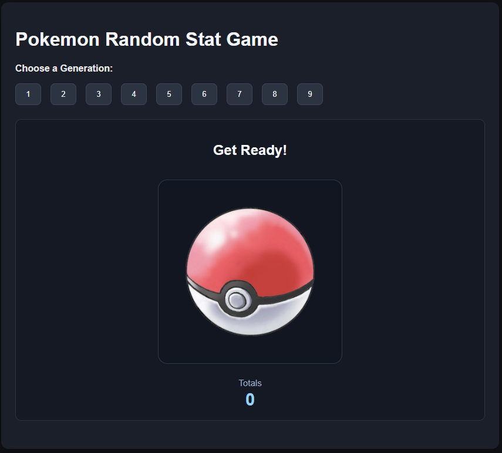
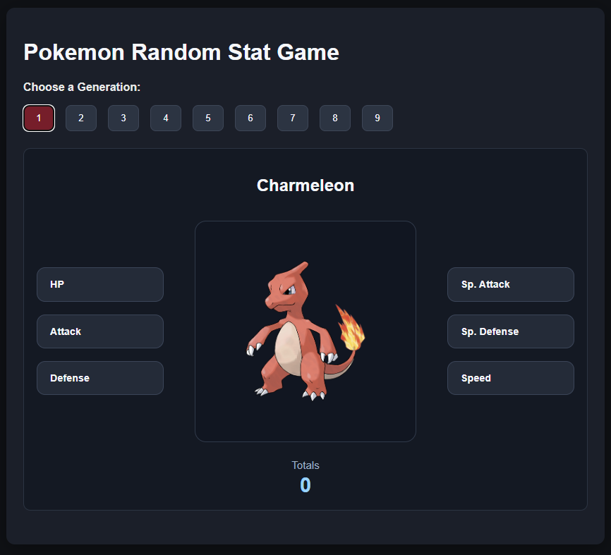
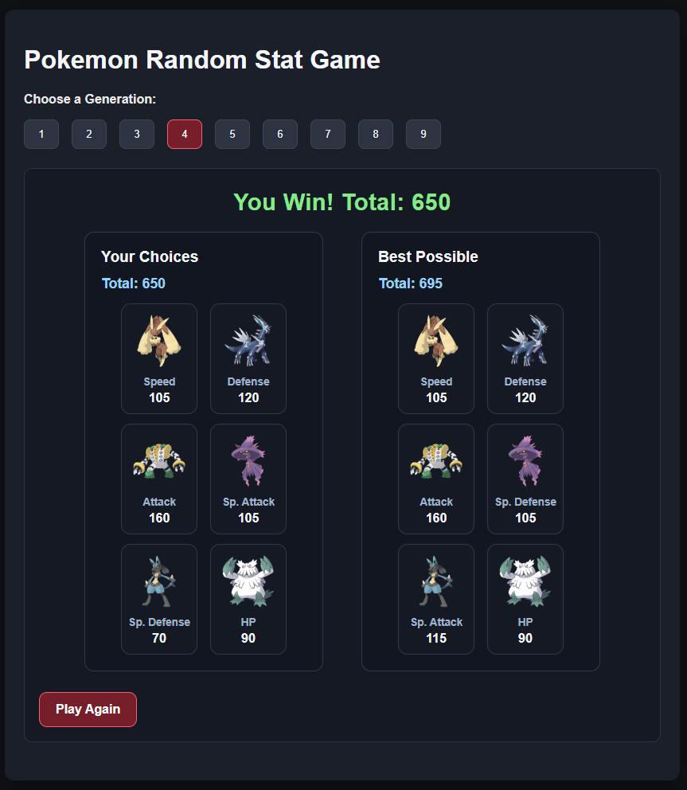
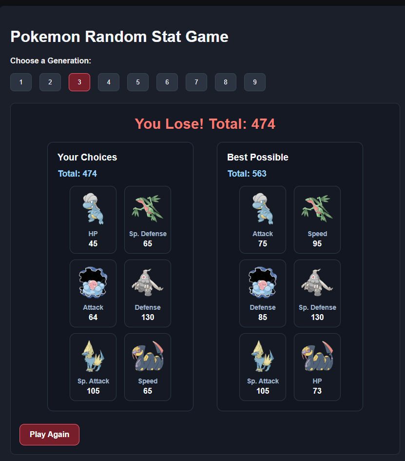

# Pokemon Random Stat Game

A strategy-based browser game where players build the strongest possible Pokémon stat combination using random Pokémon selections.
Each round presents a randomly selected Pokémon, and the player must choose one stat to lock in. Once all six stats are chosen, the final total is calculated and compared against the optimal possible result for that exact set of Pokémon.
The goal is to reach a total of 600 or higher.
This project demonstrates dynamic UI updates, algorithmic problem solving, and responsive layout design.

---

## Live Demo

[View Live Site](https://pokemon-stat-game-6n4klky8d-ruanfjacobs-projects.vercel.app/)

## Preview

Homepage\

Gameplay\

Win Result\

Lose Result\


---

## Technologies Used

- HTML5
- CSS3
- JavaScript (ES Modules)
- CSS Grid
- Flexbox
- Responsive design principles
- PokéAPI dataset (processed locally)

---

## Features

- Random Pokémon selection by generation (1–9)
- Strategic stat selection mechanic
- Six stat categories:
  - HP
  - Attack
  - Defense
  - Special Attack
  - Special Defense
  - Speed
- Live stat total calculation
- Win condition at 600 total points
- Optimal solution comparison after each run
- Visual stat strength indicator
- Responsive layout for desktop and mobile
- Clean modular data structure using external dataset file
- Automatic game restart option
- Official Pokémon artwork integration

---

## How the Game Works

1. Choose a generation
2. A random Pokémon appears
3. Select one stat from the Pokémon
4. That stat becomes locked
5. A new random Pokémon appears
6. Repeat until all six stats are chosen
7. Final total is calculated
8. The game compares your result with the best possible stat combination for that exact Pokémon set

The challenge is balancing risk vs reward when selecting stats.

## Project Structure

```
├── index.html
├── style.css
├── script.js
├── pokemon-data.js
├── README.md
├── images/
├── screenshots/
└── README.md
```

---

## How to Run Locally

1. Clone the repository
   git clone https://github.com/RuanFJacobs/pokemon-random-stat-game
2. Open the project folder
3. Open `index.html` in your browser
   Or use VS Code Live Server extension.

---

## Purpose

This project was created to demonstrate:

- JavaScript state management
- dynamic DOM rendering
- modular data separation
- algorithmic optimization logic
- responsive UI design
- structured component styling
- working with external datasets
- game mechanic implementation

The optimal stat calculation feature uses permutation logic to determine the best possible total from the same randomly selected Pokémon pool.

---

## Data Source

Pokémon base stat data derived from:

PokéAPI
https://pokeapi.co/

Official artwork sourced from the PokéAPI GitHub repository.

## Future Improvements

- animated stat selection feedback
- sound effects
- score history tracking
- difficulty modes (lower stat targets)
- generation filters (multi-gen pools)
- local storage high scores
- animation transitions between Pokémon
- improved mobile layout refinement
- loading indicator for artwork

---

## License

This project is for educational and portfolio purposes.

Pokémon and related assets are property of Nintendo / Game Freak.

---

## Author

Ruan F Jacobs
